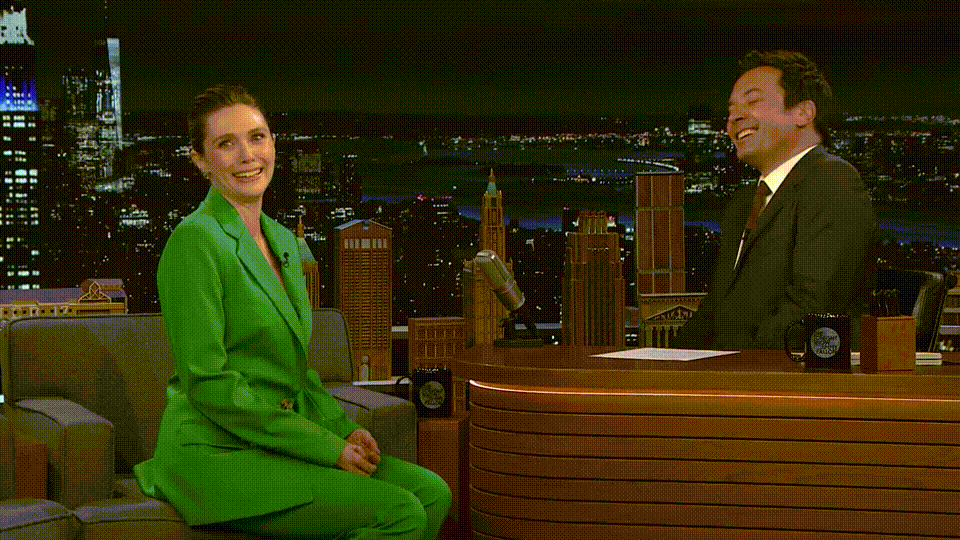
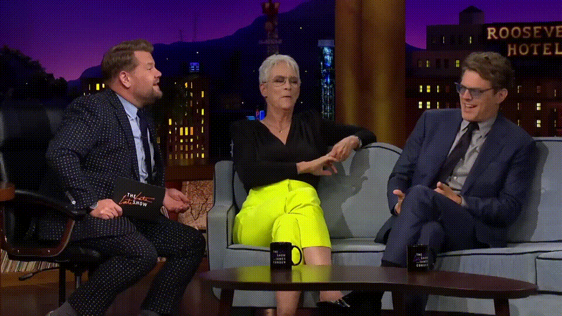
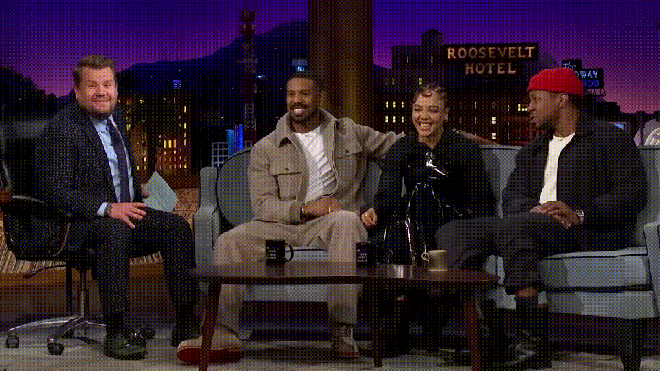

<h3>Multi-human Interactive Talking Dataset</h3>

  <a href="https://zeyu-zhu.github.io/webpage/">Zeyu Zhu</a>, 
  <a href="https://sites.google.com/view/showlab">Weijia Wu</a>, 
  <a href="https://scholar.google.com/citations?user=NgjTRe4AAAAJ&hl=zh-CN">Mike Shou Zheng</a>

 

Official repository for *Muti-human Interactive Talking Dataset*

[Project Website]()  | [Paper]()  | [Dataset]()

  

## 🔥 News
* We will release the code and dataset within 3 monthes.
* **[2025.5.11]** We initialize the Repo.

## 💾 MIT Dataset

  

We present a high-quality dataset for multi-human interactive talking video generation, comprising over \$12\$ hours of high-resolution conversational clips with diverse interaction patterns and approximately \$200\$ distinct identities from two talk shows. These curated videos form the core of our dataset, selected for their natural, engaging interactions, clear speaker dynamics, and avoidance of common visual phenomena in real-world videos such as camera motion, occlusions, and editing artifacts—ensuring clean yet diverse multi-speaker scenarios. This serves as an ideal starting resource for this challenging new task. Some samples are shown below:
<table>
  <tr>
    <td>
        
    </td>
    <td>
        
    </td>
    <td>
        
    </td>
  </tr>
</table>
<table>
  <tr>
    <td>
        
    </td>
    <td>
        
    </td>
    <td>
        
    </td>
  </tr>
</table>

We furthur expand our dataset for additional 3 hours of data from the YouTube short film channel Omeleto, which features rich, natural interactions and diverse character dynamics. While these additional videos do not contain shot transitions, they may include camera motion, occlusions, or other real-world artifacts. We believe this subset serves as a valuable challenging test set that complements the cleaner studio-style data in the main dataset. Some samples are shown below:
<table>
  <tr>
    <td>
        
    </td>
    <td>
        
    </td>
    <td>
        
    </td>
  </tr>
</table>
